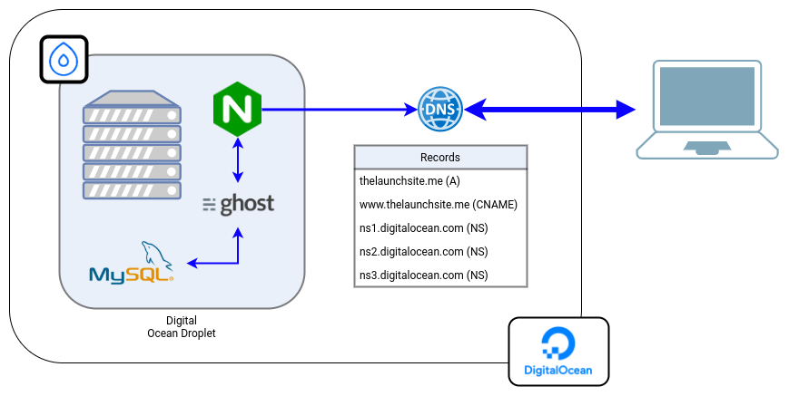

# The Launch Site

_The Launch Site_ is a simple community project, letting us provide the required infrastructure and configuration to create a simple blogging platform. So far, _The Launch Site_ let us wrap-up a complete Digital Ocean stack of resources, as described in the [Architecture](#Architecture) section.

---

## Architecture



At the moment a client establishes a connecion with the application domain, the request is directed towards Digital Ocean DNS servers. At this point, a request may be established to our website domain through an A record, pointing to the instance public IP address.

In this context, a Digital Ocean virtual machine instance is called a _droplet_. This droplet is configured with the everything required for the application to be run, such as a NGINX web server, the Ghost CMS and a MySQL database.

## Getting Started

Before proceeding to launch the stack of resources, one should get a Digital Ocean personal access token attached to a valid account. The SSH public key is required as well, used to authenticate against the droplet instance. You can pass them with a Terrraform `*.tfvars` file, as in the next example.

```hcl
do_token       = mydotoken998yhd811...
ssh_public_key = /path/to/public/key.pub
```

With Terraform configured, launching the stack is as simple as running `terraform apply`.
